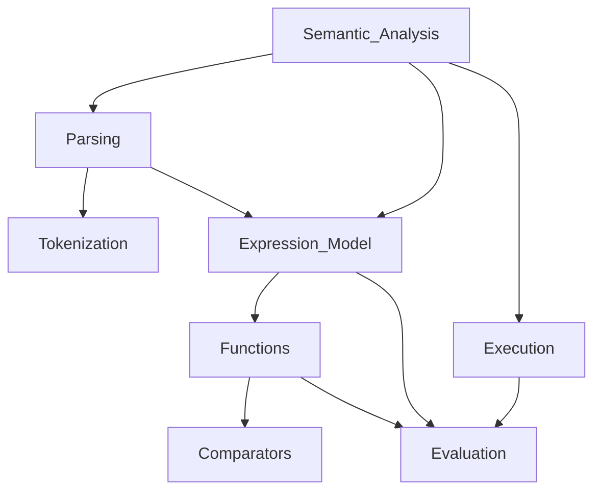
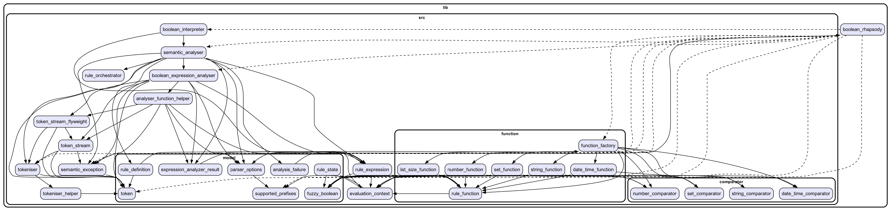

# Internal dependencies

## Simplified

```mermaid
  graph TD
  
  Parsing --> Tokenization
  Parsing --> Expression_Model

  Semantic_Analysis --> Parsing
  Semantic_Analysis --> Expression_Model
  Semantic_Analysis --> Execution

  Functions --> Evaluation
  Functions --> Comparators

  Expression_Model --> Evaluation
  Expression_Model --> Functions

  Execution --> Evaluation

  Comparators

```

## Detailed

