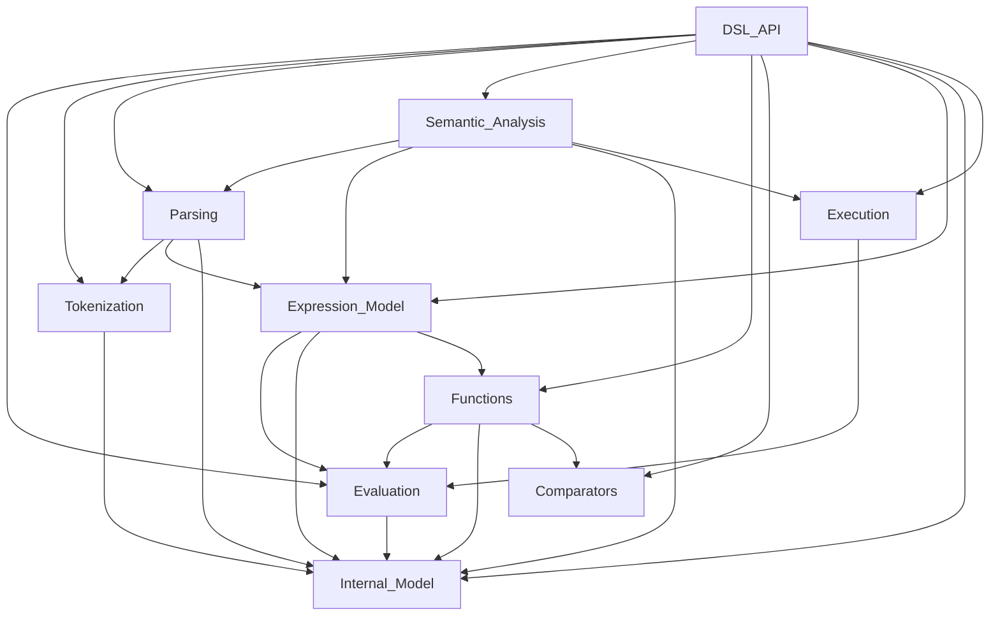

# Internal dependencies

## Simplified

```mermaid
  graph TD
  DSL_API --> Evaluation
  DSL_API --> Tokenization
  DSL_API --> Parsing
  DSL_API --> Semantic_Analysis
  DSL_API --> Functions
  DSL_API --> Comparators
  DSL_API --> Expression_Model
  DSL_API --> Internal_Model
  DSL_API --> Execution

  Evaluation --> Internal_Model

  Tokenization --> Internal_Model

  Parsing --> Tokenization
  Parsing --> Expression_Model
  Parsing --> Internal_Model

  Semantic_Analysis --> Parsing
  Semantic_Analysis --> Expression_Model
  Semantic_Analysis --> Internal_Model
  Semantic_Analysis --> Execution

  Functions --> Evaluation
  Functions --> Internal_Model
  Functions --> Comparators

  Expression_Model --> Evaluation
  Expression_Model --> Internal_Model
  Expression_Model --> Functions

  Execution --> Evaluation

  Comparators
  Internal_Model

```

## Detailed

